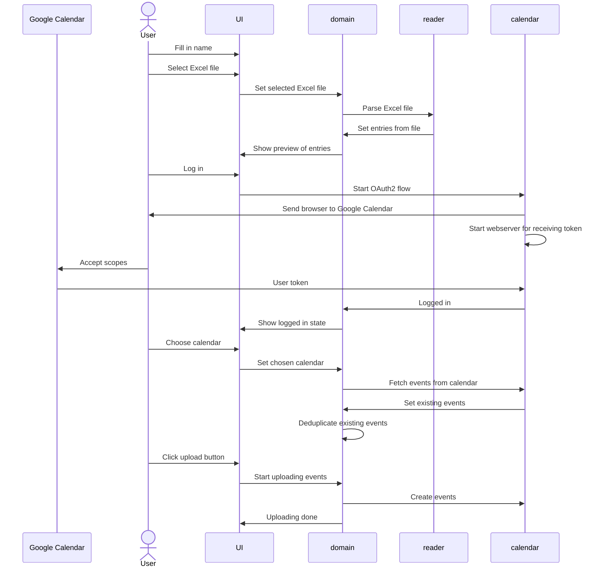

# Rooster importer from Excel to Google Calendar

The following application is a tool to read Micro$oft Excel files in a specific format, and find a particular row (that
starts with a name) of which to imterpret cells as calendar events.

## Expected Excel file structure

The following table is an example of what the Excel file should look like

| ... | ... | ... | ... |
|-----|:---:|:---:|:---:|
| ... | ... | ... | ... |
| ... | 2023-01-10 | 2023-01-11 | 2023-01-12 |
| ... | ... | ... | ... |
| ... | ... | ... | ... |
| Firstname Lastname | X | Y | Y |
| ... | ... | ... | ... |
| ... | ... | ... | ... |

It expects your Excel file to follow a similar structure as the table above:

 - Before finding the row that contains schedule information, first a row that maps each column to a particular date
   needs to be defined (above the schedule row). There are some requirements for when a row is considered to be a date
   row:
    - There need to be at least 10 dates
    - Dates need to appear in consecutive order: the cell to the left of a date must contain the date before, and the
      cell to the right must contain the date after. This is to prevent having mixups between normal date formats and
      American date formats, where a month might be misinterpreted as a day.
    - Several date formats are supported. The format should be specified with one of Excel's default formats. I don't
      know what that means as I do not use Excel. The Excel formats that are supported are:
       - mm-dd-yy
       - d-mmm-yy (02-Jan-06)
       - m/d/yy h:mm
       And two fallback formats are given, which it will try in case you cannot figure out the Excel
       formatting like a normal person:
       - yyyy-m-d
       - d-m-yyyy
 - The first column will eventually contain a name. This name will be searched for via case sensitive prefix matching.
   E.g. `Fi` will match the name `Firstname Lastname`, but `firstname Lastname` will not (because `f` is lowercase, but
   the file contains `Firstname` with uppercase).

> Note: the Excel reader will look at all sheets of the Excel file. If any sheet will not have matches, the program will
> display a warning and continue. If a processing error occurs, the program will display this error and abort. This
> means that if a sheet contains the name of the person, it must also contain a series of dates above it so that no
> processing error occurs.

## The schedule format

Currently the schedule format is hardcoded. The file `pkg/domain/events.go` is currently responsible for translating
the contents of a cell + a date to a suitable calendar entry.

## Google Calendar API integration

There are several steps required for getting the Google calendar API to work. In terms of API scopes, this application
needs the following scopes:

- `https://www.googleapis.com/auth/calendar.events` for creating events, and reading events in order to deduplicate them
- `https://www.googleapis.com/auth/calendar.readonly` for selecting one of your calendars

Create a new app in the Google Cloud console, and choose the OAuth2 setup with these scopes. After downloading the
credentials the return URL needs to be modified from `http://localhost` to `http://localhost:10321` in order to not
require firewall configuration for receiving the user's token.

## Application design

The application is roughly split up in 4 modules:

1. The domain module, which serves as a bridge between the three other modules. It also contains business logic to
   convert the contents of a cell to a calendar event (text, and datetime information).
2. The UI module, which is a wrapper around a Fyne window and is set up in such a way that it receives events over a
   channel (so that it can run asynchronously) and display things that match these events accordingly.
3. The excelreader module, which is solely responsible for finding the date rows, finding the correct schedule row, and
   associating schedule columns to a particular date.
4. The calendar module, which has the ability to list calendars, list events in a calendar, and create new events in a
   calendar.

The application flow, and the way the modules interact with each other roughly works in the following way:

# Future work

- Add the ability to customize the cellcontent <-> event mapping table
- More thorough testing
